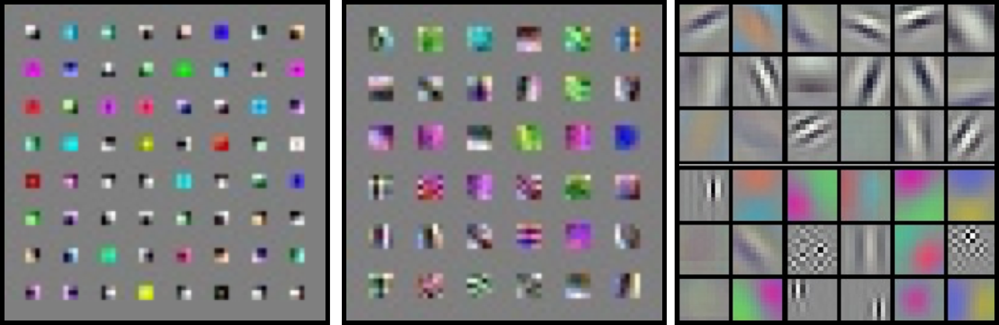

CNN Architecture Philosophies
=============================

Analogous to model design in most of machine learning and to the practice of hand-crafting features,
CNNs also involve some degree of skilled hand-crafting.
Most of hand-crafting involves the design of the architecture of the network.
This involves choosing the types and number of layers and types of activations and number of neurons in each layer.
One important design choice that arises particularly in image data and CNNs, is the design of the receptive fields.

The receptive field is typically guided by the size of filters (weights) in each layer and by the 
use of pooling layers.
The receptive field grows after each layer as the range of the signal received from the input layer 
grows progressively.
There are typically two philosophies relating to the choice of filter sizes and therefore to the 
receptive fields. 
The first was designed by Yann LeCun et al., :cite:`lecun1998gradient`, :cite:`lecun1990handwritten`
and was later re-introduced and widely preferred in modern day object categorization by Alex Krizhevsky et al., 
:cite:`krizhevsky2012imagenet`.
They employ a *relatively* large receptive field at the earlier layers and continue growing with the
rate of growth reducing by a magnitude. 
Consider AlexNet :cite:`krizhevsky2012imagenet`.
This network won the ImageNet VOC challenge :cite:`deng2009imagenet` in 2012 which involves 
recognizing objects belonging to 1000 categories with each image being :math:`224 \times 224` in size.
This network has a first layer with :math:`11 \times 11` convolutional filters (which are strided by :math:`4` pixels),
followed by a :math:`3 \times 3` pooling (strided by :math:`2`). 
The next layer is :math:`5 \times 5`, followed by :math:`3 \times 3`, each with their own respective pooling layers. 

The second of these philosophies is increasing the receptive field as minimally as possible. 
These were pioneered by the VGG group :cite:`simonyan2014very` and one particular implementation 
won the 2014 ImageNet competition :cite:`deng2009imagenet`.
These networks have a fixed filter size, typically of :math:`3 \times 3` and have fixed pooling size 
of :math:`2 \times 2` at some checkpoint layers. 
These philosophies aim to hierarchically learn better filters over various growth of small receptive fields.
The classic LeNet from Yann LeCun is a trade-off between these two case studies :cite:`lecun1998gradient`.

   Filters learnt by CNNs. 
    
The figure above show various filters that were learnt by each of these philosophies at the first layer that is closest to the image. 
From left to right are filters learnt by VGG (:math:`3 \times 3`), a typical Yann LeCun style 
LeNet (:math:`5 \times 5`) and a AlexNet (:math:`11 \times 11`).
It can be noticed that although most first layer filters adapt themselves to simple edge filters and Gabor filters, the 
:math:`3 \times 3` filters are simpler lower-dimensional corner detectors while the larger receptive field 
filters are complex high-dimensional pattern detectors.

Although we studied some popular network architecture design and philosophies, several other styles of networks also exists. 
In this section we have only studied those that feed forward from the input layer to the task layer 
(whatever that task might be) and there is only one path for gradients to flow during back-prop. 
Recently, several networks such as the GoogleNet :cite:`szegedy2015going` and the newer 
implementations of the inception layer :cite:`szegedy2016rethinking`, :cite:`szegedy2017inception`, 
Residual Net :cite:`he2016deep` and Highway Nets :cite:`srivastava2015highway` have been proposed 
that involve creating DAG-style networks that allow for more than one path to the target.
One of these paths typically involve directly feeding forward the input signal.
This therefore allows for the gradient to not attenuate and help in solving the 
vanishing gradient problems :cite:`bengio1994learning`.