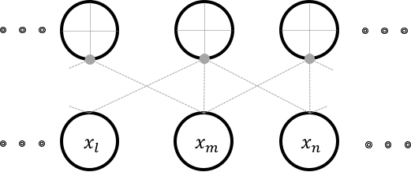
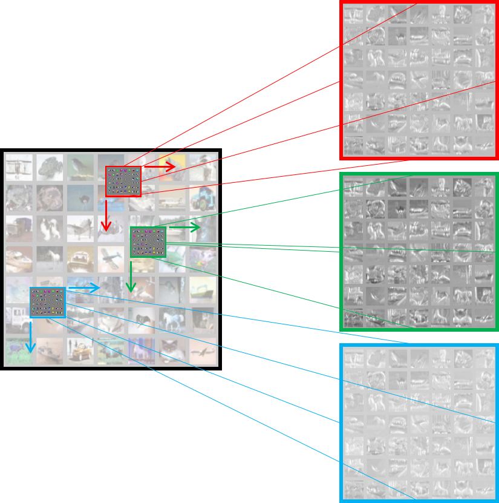
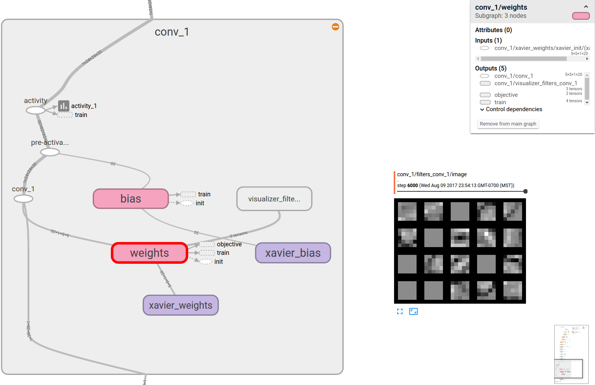

Convolutional Layers
====================

Fully-connected layers require a huge amount of memory to store all their weights.  
They involve a lot of computation as well. 
Vitally, they are not ideal for use as feature extractors for images. 
This is because, a dot product layer has an extreme receptive field. 
A receptive field of a neuron is the range of input flowing into the neuron. 
It is the view of the input that the neuron has access to to.
In our definition of the dot-product layer, the receptive field of a neuron is the length of the signal :math:`d`. 
Most image features such as SIFT or HOG have small receptive fields that are typically a few tens of pixels such as :math:`16 \times 16`.  
A convolution layer also has a small receptive field. 
This idea of having a small receptive field is also often referred to as *local-connectivity*.

    Locally-connected neurons with a receptive field of :math:`r=3`

Locality arises in this connection because the input dimensions are organized in some order of spatial significance of the input itself.
This implies that adjacent dimensions of inputs are locally-related.
Consider a neuron that has a local-receptive field of :math:`r = 3`.
The figure above illustrates this connectivity. 
Each neuron in this arrangement, is only capable of detecting a pattern in an image that is local and small. 
While each location in an image might have spatially independent features, most often in images, we find that spatial independence doesn't hold.
This implies that one feature learnt from one location of the image can be reasonably assumed to be useful at all locations. 

Although the above figure shows the neurons being independent, typically several neurons share weights.
In the representation shown in the figure, all the neurons share the same set of weights.
Even though we produce :math:`n-r+1` outputs, we only use :math:`r` unique weights.
The convolutional layer shown here takes a :math:`1D` input and is therefore a :math:`1D` convolutional layer. 
The figure below illustrates a :math:`2D` convolutional layer, which is what in reality, we are interested in.
This figure does not show independent neurons and their connectivities but instead describe the weight shared neurons as *sliding* convolutional filters.
In cases where the input has more than one channel, convolution happens along all channels independently and the outputs are summed location-wise.

    A typical convolution layer.

The :math:`2D` convolution layer typically performs the following operation:

.. math::
    z(j,d_1,d_2) = \alpha \Bigg[ \sum\limits_{c = 0}^{C-1} \sum\limits_{u=0}^{r-1}\sum\limits_{v=0}^{r-1} x_{c, d_1 + u , d_2+ u} \times w^j_{u,v} \Bigg],
    \forall j \in [0,1, \dots n] \text{ and } \forall d_1,d_2 \in [0,1, \dots d],

where, the weights :math:`\mathbf{w} \in \mathbb{R}^{j,r,r}` are :math:`j` sets of weights, each set being shared by several neurons, each with a 
receptive field of :math:`r` working on an input :math:`x \in \mathbb{R}^{d_1 \times d_2}`. 
Since we have :math:`j` sets of weights shared by several neurons, we will produce $j$ activation *images* each (due to boundary conditions) of size 
:math:`\mathbb{R}^{d - r + 1 \times d -r + 1 }`. 

In the context of convolution layers, the activations are also referred to as feature maps. 
The figure above shows three feature maps being generated at the end of the layer.
The convolutional layer's filters are also *learnt* by back-propagation and gradient descent.
Once learnt, these filters typically work as pattern detectors. 
Each filter produces one feature map.
The feature map is a spatial map of confidence values for the existence of the pattern, the filter has adapted to detect.

.. _conv_implementation:

Implementation
--------------

Similar to the dot-product layer, the conv layer implementation is also very similar to a theano structure.
It can be implemented as follows:

.. code-block:: python

    # Create graph variables using the same xavier initialization
    weights = tf.Variable(initializer(  f_shp, 
                                        name = 'xavier_weights'),\
                                        name = 'weights')
    bias = tf.Variable(initializer([neurons], name = 'xavier_bias'), name = 'bias')
    # Produce the convolution output 
    c_out = tf.nn.conv2d(   input = input,
                            filter = weights,
                            strides = stride,
                            padding = padding,
                            name = scope.name  )
    c_out_bias = tf.nn.bias_add(c_out, bias, name = 'pre-activation')
    # activation through relu
    activity = tf.nn.relu(c_out_bias, name = 'activity')

    # Prepare summaries. Notice how even 4D tensors can be summarized using histogram
    tf.summary.histogram('weights', weights)
    tf.summary.histogram('bias', bias)  
    tf.summary.histogram('activity', activity) 

    # Visualize the first layer weights
    visualize_filters(weights, name = 'filters_' + name)

While most of the code is easily understandable and migrated analogously from theano, the visualization needs 
to be adapted for tensorboard. The :meth:`lenet.support.visualize_filters` method is a wrapper to a nice function 
written by `kukurza <https://github.com/kukuruza>`_ . The code rastarizes the filters similar to what we 
are used to from pylearn2. The original code is hosted on their `gist <https://gist.github.com/kukuruza/03731dc494603ceab0c5>`_ .
My modified version is in :meth:`lenet.third_party.put_kernels_on_grid`.

    A convolution layer scope visualized in tensorboard. The filters that it learnt are also shown.

Some arguments to :meth:`tf.nn.conv2d` are different from theano's ``conv2d`` structure. 
For instance, the arguments supplied here are:

.. code-block:: python 

    filter_size = (5,5), 
    stride = (1,1,1,1), 
    padding = 'VALID',

Also the filter and image shapes is a little different as well. 
Images are 4D tensors in NHWC format.
NHWC stands for number of images, height, width and channels, which for theano users is the ``b01c``.
This format difference is what that put me off while trying to implement this myself and is a useful reminders for migrants 
to keep in the back of their minds. 
The filters created in the :meth:`lenet.support.initializer` method take ``f_shp`` shape where,

.. code-block:: python

    f_shp = [filter_size[0], filter_size[1], input.shape[3].value, neurons]

That is, filter height, filter width, input channels, number of kernels. 
This is also a little strange for theano users and might take some getting used to. 
The entire layer class description can be found in the :meth:`lenet.layers.conv_2d_layer` method.