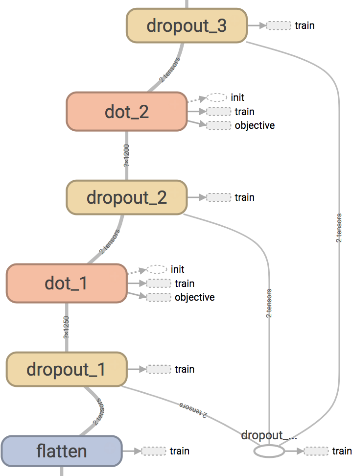

Dropout Layers
==============

Dropout layers are an indirect means of regularization and ensemble learning for neural networks :cite:`srivastava2014dropout`.
Consider that we have a layer with :math:`n` activations.
Consider now,  we randomly zero-out neurons independently with Bernoulli probability :math:`0.5` everytime we provide 
the network a training sample. 
We update the weights for only those weights that were not zeroed-out during backprop.
This in essence is the working of dropouts. 

Dropouts have several different interpretations.
The first and most often used is that dropout is a form of ensembling.
In this form of dropping out some neurons, we are in-effect sampling from a pool of :math:`2n` architectures, every time we feed-forward 
the sample is going through a new architecture (network).
Which means each *network* in this pool of network architectures will only see one if it sees any sample at all.
We train each of these networks with one update.
Since all the networks in this system share weights, they all learn simultaneously.

During test time, we halve the weights (if we used :math:`0.5` as the Bernoulli probability) of weights.
This halving is needed because during test time we do not dropout and the output signals of each layer are therefore in expectation doubled.
Theoretically, this halving (at least with just one layer) is the same as the output of the geometric ensemble of all the networks in the pool.

A second way of looking at dropout is from a regularization perspective.
Dropouts are a strong form of regularizer, because in the pool of all th networks, one can think of dropouts as penalizing the network
in learning weights that are regularized by the weights on the other networks.
Yet another perspective of dropout is that dropout avoid neurons to co-adapt with each other.
They learn functionalities that are unique to itself and are independent. 
Therefore dropout neurons are more powerful than co-adapted neurons. 

Implementation
--------------

In theano, dropouts are typically implemented as follows:

.. code-block:: python 

    from theano.sandbox.rng_mrg import MRG_RandomStreams as RandomStreams
    # from theano.tensor.shared_randomstreams import RandomStreams
    # The above import is an experimental code. Not sure if it works perfectly, but I have seen no problems
    # yet.
    srng = RandomStreams(rng.randint(1,2147462468), use_cuda=None)
    # I have raised this issue with the theano guys, use_cuda = True is creating a duplicate
    # process in the GPU.
    mask = srng.binomial(n=1, p=1-dropout_rate, size=params.shape, dtype = theano.config.floatX )
    output = input * mask

Ignoring the comments about the ``RandomStreams`` itself, the implementation is a little quirky. 
We create a ``mask`` which is the same shape as the input, and multiply the input by that mask to get the dropout output.
This output is used during training time.
We create another *parallel copy of the network* which uses the already initialized weights but are *halved* during inference time.

.. code-block:: python

        # If dropout_rate is 0, this is just a wasted multiplication by 1, but who cares.
        w = dropout_layer.w * (1 - dropout_rate)
        b = dropout_layer.b 

        inference_layer = dot_product_layers(params = [w,b] )

Assuming of course that the layers are defined as classes.

In tensorflow, we will make use a *placeholder* node in the graph to implement this system (which also could be done using theano). 
A placeholder is a node in tensorflow similar to :meth:`theano.tensor` or :meth:`theano.scalar`. 
Let us create the dropout probability as a placeholder node.

.. code-block:: python

    dropout_prob = tf.placeholder(tf.float32, name = 'dropout_probability')
    
In tensorflow, we have a ``dropout`` method written for us internally, which can use a placeholder probability node.
Let us supply the placeholder we created into the dropout layer method and create a dropout layer.

.. code-block:: python

    output = tf.nn.dropout (input, dropout_prob)

During test time, we can feed into the placeholder :math:`1.0`, which implies that none of the nodes are dropped out.
During training time, we can feed whatever value we want into the dropout variable. 
The internal tensorflow implementation of dropout will scale the input accordingly (note that it does not scale the 
weights, so this has problems when implementing on non-dot-product layers some times).

When there are multiple layers, we can still use the same placeholder and therefore control the action of dropout globally.
The tensorboard will look like the following when we use these ideas to create dropout layers. 

    
    Dropout visualized in tensorflow. One placeholder controls three dropout layers. Note: we also dropout the *input* signal 
    even before the first dot-product layer. This idea was taken from the de-noising auto-encoder paper :cite:`vincent2008extracting`.

The layer definition can be seen in the :meth:`lenet.layers.dropout_layer` module.