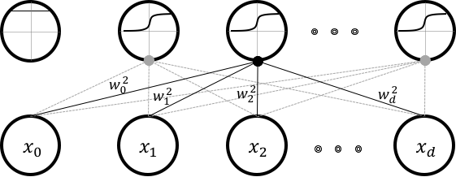
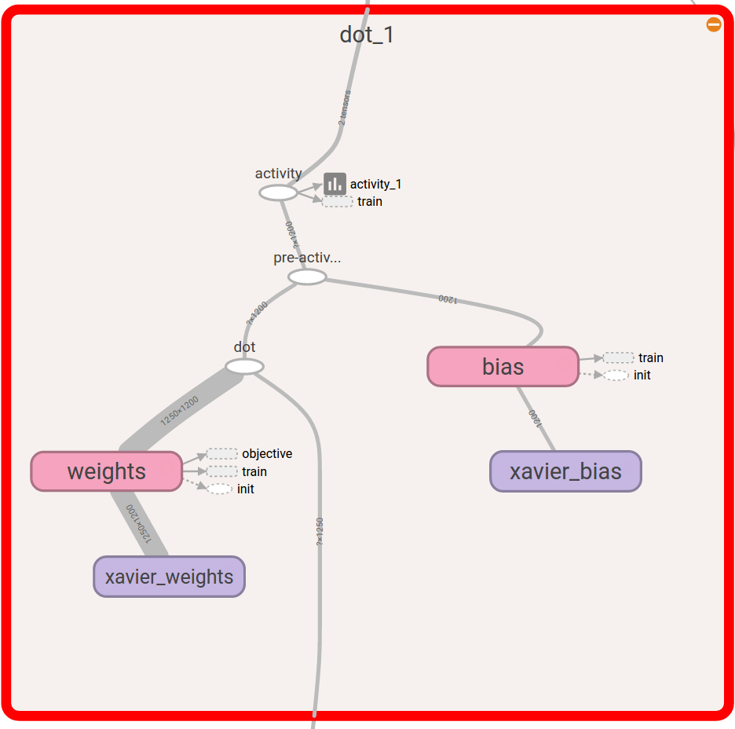

Dot-Product Layers
==================

Consider a :math:`1D` vector of inputs :math:`\mathbf{x} \in [x_0,x_1, \dots x_d]` of :math:`d` dimensions. 
This may be a vectorized version of the image or may be the output of a preceding layer. 
Consider a dot-product layer containing :math:`n` neurons. 
The :math:`j`:sup:`th` neuron in this layer will simply perform the following operation,

.. math::
    z_j = \alpha \Bigg(\sum\limits_{i=0}^{d-1} x_i \times w_i^j \Bigg),

where,  :math:`\alpha` is typically an element-wise monotonically-increasing function that scales the output of the dot-product.
:math:`\alpha` is commonly referred to as the activation function. 
The activation function is used typically as a threshold, that either turns ON (or has a level going out) or OFF, the neuron.
The neuron output that has been processed by an activation layer is also referred to as an *activity*.
Inputs can be processed in batches or mini-batches through the layer. 
In these cases :math:`\mathbf{x}` is a matrix in :math:`\mathbb{R}^{b \times d}`, where :math:`b` is the batch size. 
Together, the vectorized output of the layer is the dot-product operation between the weight-matrix of the layer and the input signal batch,

.. math::
    \mathbf{z} = \alpha ( \mathbf{x} \cdot \mathbf{w} ),

where, :math:`\mathbf{z} \in \mathbb{R}^{b \times n}`, :math:`\mathbf{w} \in \mathbb{R}^{d \times n}` and the :math:`(i,j)^{\text{th}}` element of 
:math:`\mathbf{z}` represents the output of the :math:`j^{\text{th}}` neuron for the :math:`i^{\text{th}}` sample of input. 

    A typical dot-product layer

The above figure shows such a connectivity of a typical dot-product layer. 
This layer takes in an input of :math:`d` dimensions and produces an output of :math:`n` dimensions. 
From the figure, it should be clear as to why dot-product layers are also referred to as fully-connected layers. 
These weights are typically *learnt* using back-propagation and gradient descent :cite:`rumelhart1985learning`.

Implementation
--------------

Dot-product layers are implemented in tensorflow by using the :meth:`tf.matmul` operation, which is a 
dot product operation. Consider the following piece of code:

.. code-block:: python

    # Open a new scope
    with tf.variable_scope('fc_layer') as scope:
        # Initialize new weights
        weights = tf.Variable(initializer([input.shape[1].value,neurons], name = 'xavier_weights'),\
                                            name = 'weights')
        # Initialize new bias
        bias = tf.Variable(initializer([neurons], name = 'xavier_bias'), name = 'bias')
        # Perform the dot product operation
        dot = tf.nn.bias_add(tf.matmul(input, weights, name = 'dot'), bias, name = 'pre-activation')
        activity = tf.nn.relu(dot, name = 'activity' )  # relu is our alpha and activity is z             

        # Add things to summary
        tf.summary.histogram('weights', weights)
        tf.summary.histogram('bias', bias)  
        tf.summary.histogram('activity', activity) 

This code block is very similar to how a dot product would be implemented in theano. For instance,
in `yann <http://www.yann.network>`_ I implemented a dot product layer like so:

.. code-block:: python

    w_values = numpy.asarray(0.01 * rng.standard_normal(
                size=(input_shape[1], num_neurons)), dtype=theano.config.floatX)
    weights = theano.shared(value=w_values, name='weights')
    b_values = numpy.zeros((num_neurons,), dtype=theano.config.floatX)
    bias = theano.shared(value=b_values, name='bias')
    dot = T.dot(input, w) + b
    activity = theano.nnet.relu(dot)

We can already see that the :meth:`theano.shared` equivalent in tensorflow is the :meth:`tf.Variable`. They 
work in similar fashion as well. :meth:`tf.Variable` is a node in a computational graph, just like :meth:`theano.shared`
variable. Operationally, the rest is easy to infer from the code itself. 

There are some newer elements in the tensorflow code. Tensorflow graph components (variables and ops)
could be enclosed using :meth:`tf.variable_scope` declarations. I like to think of them as *boxes* to put things in 
literally. Once we go through tensorboard, it can be noticed that sometimes they literally are boxes. 
For instance, the following is a tensorboard visualization of this scope. 

    A dot-product layer scope visualized in tensorboard

The initialization is also nearly the same. 
The API for the Xavier initializer can be found in the :meth:`lenet.support.initializer` module.
Tensorflow `summaries <https://www.tensorflow.org/api_guides/python/summary>`_ is an entirely new option 
that is not available clearly in theano. Summaries are hooks that can write down or export information
presently stored in graph components that can be used later by tensorboard to read and present in a nice 
informative manner. They can be pretty much anything of a few popular hooks that tensorflow allows.
the ``summary.histogram`` allows us to track the histogram of particular variables as they change 
during iterations. We will go into more detail about summaries as we study the :meth:`lenet.trainer.trainer.summaries` method, but 
at this moment you can think of them as *hooks* that export data. 

The entire layer class description can be found in the :meth:`lenet.layers.dot_product_layer` method.