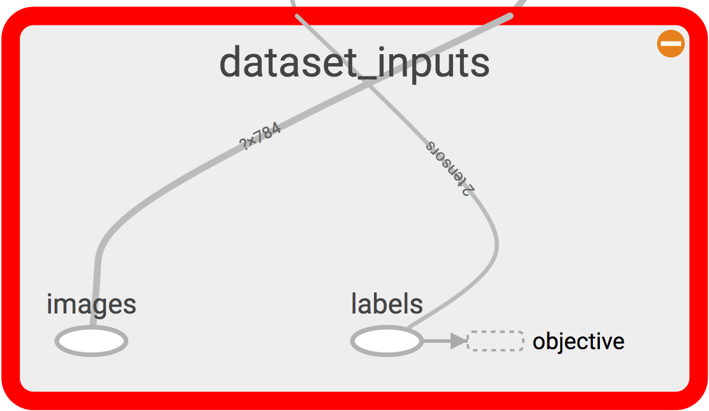

Network
=======

Now that we have seen all the layers, let us assemble our network together. 
Assembling the network together takes several steps and tricks and there isn't one way to do that.
To make things nice, clean and modular, let us use python class to structure the network class.
Before we even begin the network, we need to setup the dataset. 
We can then setup our network. 
We are going to setup the popular Lenet5 :cite:`lecun1990handwritten`. 
This network has many incarnations, but we are going to setup the latest one.
The MNIST images that are input are :math:`28 \times 28`. 
The input is fed into two convolution layers with filter sizes :math:`5 \times 5` and :math:`3 \times 3`
with :math:`20` and :math:`50` filters, respectively. 
This is followed by two fully-connected layers of :math:`800` neurons each.
The last softmax layer will have :math:`10` nodes, one for each class. 
In between, we add some dropout layers and normalization layers, just to make things a little better.

Let us also fix this by using global definitions (refer to them all in ``lenet.gloabl_definitions`` module).

.. code-block:: python

    # Some Global Defaults for Network
    C1 = 20     # Number of filters in first conv layer
    C2 = 50     # Number of filters in second conv layer
    D1 = 1200    # Number of neurons in first dot-product layer
    D2 = 1200    # Number of neurons in second dot-product layer
    C = 10      # Number of classes in the dataset to predict   
    F1 = (5,5)  # Size of the filters in the first conv layer
    F2 = (3,3)  # Size of the filters in the second conv layer
    DROPOUT_PROBABILITY = 0.5 # Probability to dropout with.

    # Some Global Defaults for Optimizer
    LR = 0.01   # Learning rate 
    WEIGHT_DECAY_COEFF = 0.0001 # Co-Efficient for weight decay
    L1_COEFF = 0.0001 # Co-Efficient for L1 Norm
    MOMENTUM = 0.7 # Momentum rate 
    OPTIMIZER = 'adam' # Optimizer (options include 'adam', 'rmsprop') Easy to upgrade if needed.

Dataset
-------

Tensorflow examples provides the MNIST dataset in a nice feeder-worthy form, which as a theano user,
I find very helpful. 
The example itself is at :meth:`tf.examples.tutorials.mnist.input_data` for those who want to check it out.
You can quite simply import this feeder as follows:

.. code-block:: python

    from tensorflow.examples.tutorials.mnist import input_data as mnist_feeder  

Using this, let us create a class that will not only host this feeder, but will also have some placeholders 
for labels and images.

.. code-block:: python

    def __init__ (self, dir = 'data'):
        self.feed = mnist_feeder.read_data_sets (dir, one_hot = True)

        #Placeholders
        with tf.variable_scope('dataset_inputs') as scope:
            self.images = tf.placeholder(tf.float32, shape=[None, 784], name = 'images')
            self.labels = tf.placeholder(tf.float32, shape = [None, 10], name = 'labels')

This now creates the following section of the graph:

   Dataset visualized in tensorboard. 

Fashion-MNIST
+++++++++++++

`Fashion-MNIST <https://github.com/zalandoresearch/fashion-mnist/blob/master/doc/arxiv.pdf>`_ is a new 
dataset that appears to take the place of MNIST as a good CV baseline dataset. 
It has the same characteristics as MNIST itself and could be a good drop-in dataset in this tutorial.
If you prefer using this dataset instead of the classic MNIST, simply download the dataset from 
`here <https://github.com/zalandoresearch/fashion-mnist#get-the-data>`_ into the ``data/fashion``
directory and use the :meth:`lenet.dataset.fashion_mnist` instead of the old :meth:`lenet.dataset.mnist`
method. 
This uses the data in the new directory. 

Network Architecture
---------------------

With all this initialized, we can now create a network class (:class:`lenet.network.lenet5`), whose constructor will 
take this image placeholder.

.. code-block:: python

    def __init__ (  self,
                    images ):
        """
        Class constructor for the network class. 
        Creates the model and all the connections. 
        """
        self.images = images

As can be seen in the documentation of :class:`lenet.network.lenet5`, I have a habit of assigning some variables with ``self`` so that 
I can have access to them via the objects. 
This will be made clear when we study further :class:`lenet.trainer.trainer` module and others.
For now, let us proceed with the rest of the network architecure.

The first thing we need is to *unflatten* the images placeholder into square images.
We need to do this because the images placeholder contains images in shape :math:`\mathbf{x} \in [x_0,x_1, \dots x_d]` of :math:`d` dimensions.
To have the input feed into a convolution layer, we want, 4D tensors in NHWC format as we discussed in the convolution layer :ref:`conv_implementation` section.
Let us continue building our network constructor with this unflatten added. 

.. code-block:: python 

    images_square = unflatten_layer ( self.images )
    visualize_images(images_square)    

The method :meth:`lenet.support.visualize_images` will simply add these images to tensorboard summaries so that we can see them in the tensorboard.
Now that we have a unflattened image node in the computational graph, let us construct a couple of convolutional layers, 
pooling layers and normalization layers.

.. code-block:: python

    # Conv Layer 1
    conv1_out, params =  conv_2d_layer (    input = images_square,
                                            neurons = C1,
                                            filter_size = F1,
                                            name = 'conv_1',
                                            visualize = True )
    process_params(params)
    pool1_out = max_pool_2d_layer ( input = conv1_out, name = 'pool_1')
    lrn1_out = local_response_normalization_layer (pool1_out, name = 'lrn_1' )

    # Conv Layer 2
    conv2_out, params =  conv_2d_layer (    input = lrn1_out,
                                            neurons = C2,
                                            filter_size = F2,
                                            name = 'conv_2' )
    process_params(params)
    
    pool2_out = max_pool_2d_layer ( input = conv2_out, name = 'pool_2')
    lrn2_out = local_response_normalization_layer (pool2_out, name = 'lrn_2' )

:meth:`lenet.layers.conv_2d_layer` returns one output tensor node in the computation graph and also 
returns the parameters list ``[w, b]``. 
The parameters are sent to the :meth:`lenet.network.process_params`.
This method is a simple method which will add the parameters to various *collections*.

.. code-block:: python

    tf.add_to_collection('trainable_params', params[0])
    tf.add_to_collection('trainable_params', params[1])         
    tf.add_to_collection('regularizer_worthy_params', params[0]) 

These tensorflow collections span throughout the implementation session, therefore these collections 
can be used at a later time to apply gradients to the ``trainable_params`` collections or to add 
regularization to ``regularizer_worthy_params``. I typically do not regularize biases. 

If this method was not called after a layer was added, you can think of it as being used for frozen or 
obstinate layers as is typically used in mentoring networks purposes :cite:`venkatesan2016diving`.
We now move on to the fully-connected layers. Before adding them, we need to *flatten* the outputs we 
have so far. We can use the :meth:`lenet.layers.flatten_layer` to reshape the outputs.

.. code-block:: python 

    flattened = flatten_layer(lrn2_out)

In case we are implementing a dropout layer, we need a dropout probability placeholder that we can 
feed in during train and test time. 

.. code-block:: python

    self.dropout_prob = tf.placeholder(tf.float32, name = 'dropout_probability')

Let us now go ahead and add some fully-connected layers along with some dropout layers.

.. code-block:: python

    # Dropout Layer 1 
    flattened_dropout = dropout_layer ( input = flattened, prob = self.dropout_prob, name = 'dropout_1')                                          

    # Dot Product Layer 1
    fc1_out, params = dot_product_layer  ( input = flattened_dropout, neurons = D1, name = 'dot_1')
    process_params(params)

    # Dropout Layer 2 
    fc1_out_dropout = dropout_layer ( input = fc1_out, prob = self.dropout_prob, name = 'dropout_2')
    # Dot Product Layer 2
    fc2_out, params = dot_product_layer  (  input = fc1_out_dropout, neurons = D2, name = 'dot_2')
    process_params(params)

    # Dropout Layer 3 
    fc2_out_dropout = dropout_layer ( input = fc2_out, prob = self.dropout_prob, name = 'dropout_3')

Again we supply the parameters through to a regularizer. Finally, we add a 
:meth:`lenet.layers.softmax_layer`.

.. code-block:: python

    # Logits layer
    self.logits, params = dot_product_layer  (  input = fc2_out_dropout, neurons = C,
                                                activation = 'identity', name = 'logits_layer')
    process_params(params)

    # Softmax layer
    self.inference, self.predictions = softmax_layer ( input = self.logits, name = 'softmax_layer') 

We use the :meth:`lenet.layers.dot_product_layer` to add a ``self.logits`` node that we can pass 
through to the softmax layer that will provide us with a node for ``self.inference`` and 
``self.predictions``. 

.. figure:: figures/network.png
   :scale: 90 %
   :align: center

   Network visualized in tensorboard.

Putting all this together, the network will look like the image above in tesorboard.
The complete definition of this network class could be found in the class constructor of 
:class:`lenet.network.lenet5`. 

Cooking the network
-------------------

Before we begin training though, the network needs several things added to it. The first one of which 
is a set of cost and objectives. Firstly we begin with adding a ``self.labels`` property to the network class.
This placeholder comes from the :class:`lenet.dataset.mnist` class. 

For a loss we can start with a categorical cross entropy loss. 

.. code-block:: python 

    self.cost = tf.reduce_mean( tf.nn.softmax_cross_entropy_with_logits ( labels = self.labels,
                                                                          logits = self.logits) )
    tf.add_to_collection( 'objectives', self.cost ) 
    tf.summary.scalar( 'cost', self.cost ) 

The method :meth:`tf.nn.softmax_cross_entropy_with_logits` is another unique feature of tensorflow.
This method will take in ``logits`` which are the outputs of the identity dot-product layer 
before the softmax, apply softmax to it and estimate its cross-entropy loss with a one-hot vector
version of labels provided to the ``labels`` argument, all doing so efficiently.

We can add this to the ``objectives`` collection. 
Collections are in essence, kind of like lists that span globally as long as we are in the same 
tensorflow shell. 
There are much more to it, but for a migrant, at this stage, this is simple. 
We can add up everything in the ``objectives`` collection which ends up in a node that we want to minimize.
For instance, we can add regularizers to the ``objectives`` collection also, so that they all can be added to 
the minimizing node.
Since :meth:`lenet.network.process_params` method was called after all params were created and we added 
parameters to collections, we can apply regularizers to all parameters in the collection.

.. code-block:: python
    
    var_list = tf.get_collection( 'regularizer_worthy_params')
    apply_regularizer (var_list)

where, the :meth:`lenet.network.apply_regularizer` adds :math:`L1` and :math:`L2` regularizers.

.. code-block:: python 

    for param in var_list:
        norm = L1_COEFF * tf.reduce_sum(tf.abs(param, name = 'abs'), name = 'l1')
        tf.summary.scalar('l1_' + param.name, norm)                  
        tf.add_to_collection( 'objectives', norm)

    for param in var_list:
        norm = WEIGHT_DECAY_COEFF * tf.nn.l2_loss(param)
        tf.summary.scalar('l2_' + param.name, norm)                  
        tf.add_to_collection('objectives', norm)

Most of the methods used above are reminiscent of theano except for :meth:`tf.nn.l2_loss`, which 
should also be obvious to understand.

The Overall objective of the network is, 

.. math::

    o = \frac{−1}{b} \sum_{i=1}^{n} \sum_{j=1}^{m} y_{ij}\log(l_{ij}) + 
        l_1  \sum \vert w \vert + l_2  \sum \vert \vert w \vert \vert , \forall w \in \mathcal{N}. 

This is essentially, the cross-entropy loss added with the weighted sum of :math:`L1` and :math:`L2` norms of all 
the weights in the network. 
Cumulatively the objective :math:`o` can be calculated as follows:

.. code-block:: python 

    self.obj = tf.add_n(tf.get_collection('objectives'), name='objective')
    tf.summary.scalar('obj', self.obj)  

Also, since we have an ``self.obj``, we can then add an ADAM optimizer that minimizes the node.

.. code-block:: python

    back_prop = tf.train.AdamOptimizer( learning_rate = LR, name = 'adam' ).minimize( 
                                                            loss = self.obj, var_list = var_list) 

In tensorflow, adding optimizer is as simple as that.
In theano, we would have had to use :meth:`theano.tensor.grad` method to extract gradients for 
each parameter and then write codes for weight updates and use :meth:`theano.function` to create
update rules.
In tensorflow, we can create a :meth:`tf.train.Optimizer.minimize` node that can be run in a 
:meth:`tf.Session`, session, which will be covered in :class:`lenet.trainer.trainer`.
Similarly, we can do different optimizers.

With the optimizer is done, we are done with the training part of the network class.
We can now move on to other nodes in the graph that could be used at inference time.
We can create one node, which will create a flag for every correct predictions that the network is 
making using :meth:`tf.equal`.

.. code-block:: python 

    correct_predictions = tf.equal(self.predictions, tf.argmax(self.labels, 1), \
                                                name = 'correct_predictions')

We can then create one node, which will estimate accuracy and add it to summaries so we can actively
monitor it. 

.. code-block:: python 

    self.accuracy = tf.reduce_mean(tf.cast(correct_predictions, tf.float32) , name ='accuracy')                                     
    tf.summary.scalar('accuracy', self.accuracy) 

Tensorflow provides a method for estimating confusion matrix, give labels. We can estimate labels 
from our one-hot labels, using the :meth:`tf.argmax` method and create a ``confusion`` node.
If we also reshape this into an image, we can then add this as an image to the tensorflow summary.
This implies that we will be able to monitor it as an image visualization.

.. code-block:: python 

    confusion = tf.confusion_matrix(tf.argmax(self.labels,1), self.predictions,
                                    num_classes=C,
                                    name='confusion')
    confusion_image = tf.reshape( tf.cast( confusion, tf.float32),[1, C, C, 1])
    tf.summary.image('confusion',confusion_image)    

This concludes the network part of the computational graph. The cook method is described in 
:meth:`lenet.network.lenet5.cook` and the entire class in :class:`lenet.network.lenet5`.