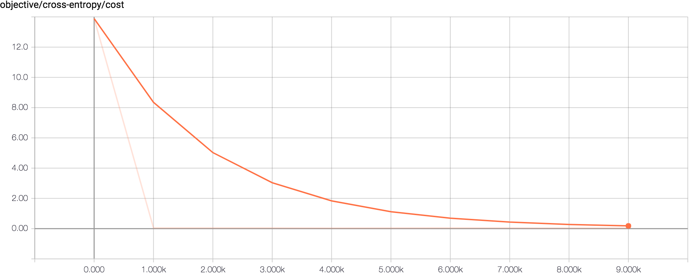
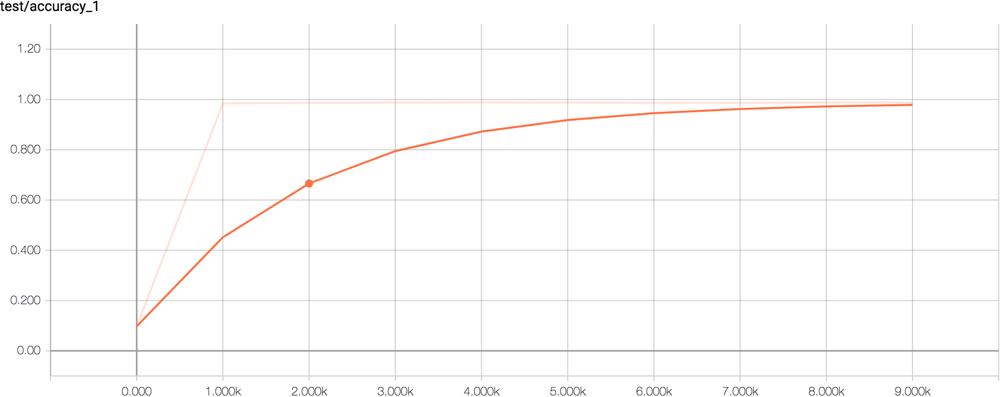
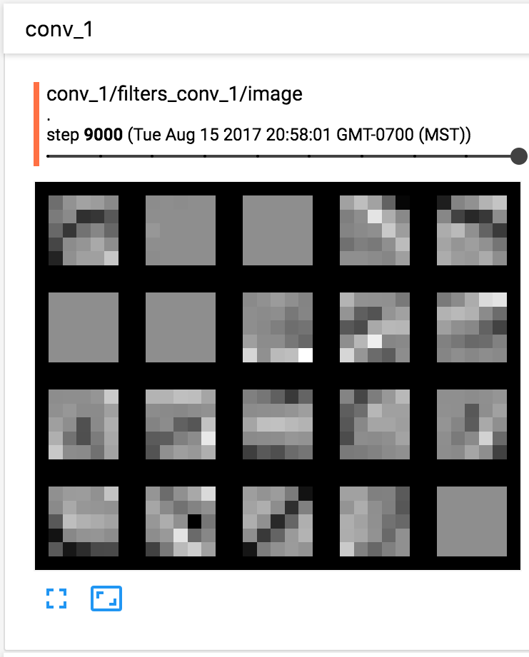
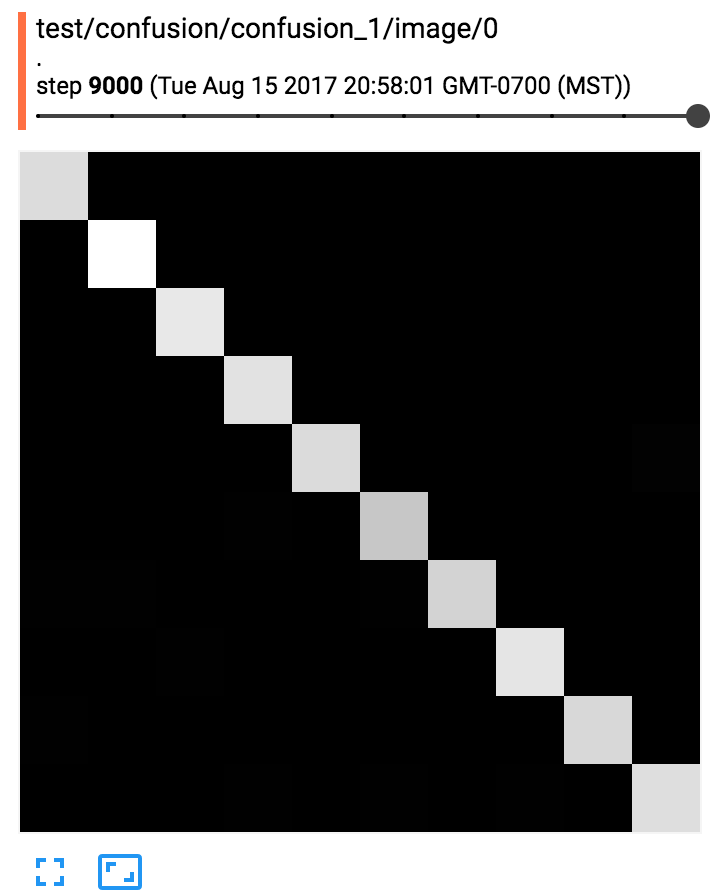
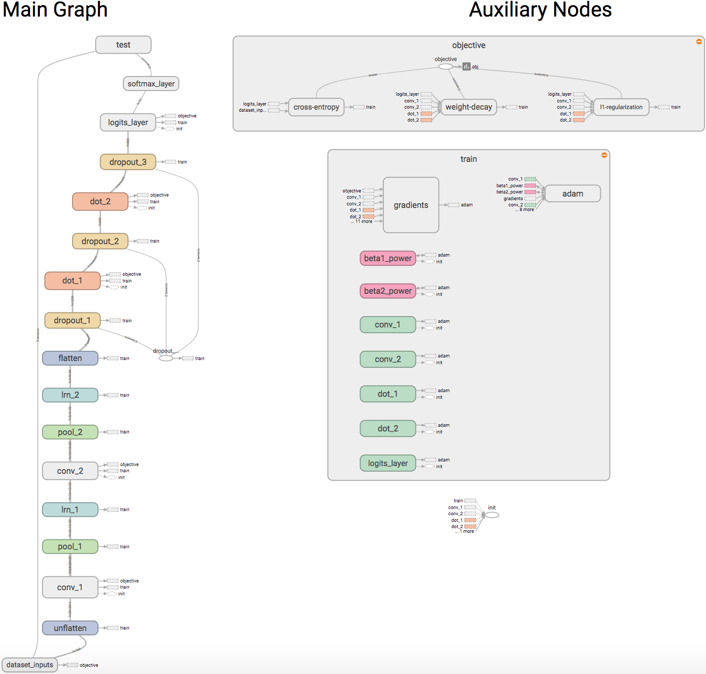

Run and Outputs
===============

``main.py`` essentially guides how to run the code.
Firstly import all the modules we have created. 

.. code-block:: python 

    from lenet.trainer import trainer
    from lenet.network import lenet5      
    from lenet.dataset import mnist

Begin by creating the dataset and its placeholders,

.. code-block:: python

    dataset = mnist()   

Create the network object and cook it.

.. code-block:: python

    net = lenet5(images = dataset.images)  
    net.cook(labels = dataset.labels)

Create a trainer module that takes as input, the cooked network and the datafeed and then train it.

.. code-block:: python

    bp = trainer (net, dataset.feed)
    bp.train()

If everything went correctly, the following output would have been produced:

.. code-block:: bash

    Extracting data/train-images-idx3-ubyte.gz
    Extracting data/train-labels-idx1-ubyte.gz
    Extracting data/t10k-images-idx3-ubyte.gz
    Extracting data/t10k-labels-idx1-ubyte.gz
    .
    .
    .
    .
    name: GeForce GTX 1080
    major: 6 minor: 1 memoryClockRate (GHz) 1.7335
    pciBusID 0000:02:00.0
    Total memory: 7.91GiB
    Free memory: 7.80GiB
    2017-08-15 19:58:04.465420: W tensorflow/stream_executor/cuda/cuda_driver.cc:485] creating context when one is currently active; existing: 0x3eec930
    2017-08-15 19:58:04.513975: I tensorflow/core/common_runtime/gpu/gpu_device.cc:887] Found device 1 with properties: 
    name: NVS 310
    major: 2 minor: 1 memoryClockRate (GHz) 1.046
    pciBusID 0000:01:00.0
    Total memory: 444.50MiB
    Free memory: 90.00MiB
    2017-08-15 19:58:04.514091: W tensorflow/stream_executor/cuda/cuda_driver.cc:485] creating context when one is currently active; existing: 0x3ee8b70
    2017-08-15 19:58:04.770913: I tensorflow/core/common_runtime/gpu/gpu_device.cc:887] Found device 2 with properties: 
    name: GeForce GTX 1080
    major: 6 minor: 1 memoryClockRate (GHz) 1.7335
    pciBusID 0000:03:00.0
    Total memory: 7.91GiB
    Free memory: 7.80GiB
    .
    .
    .
    .
    Iter 0 Objective 6.67137 Cost 2.39042 Test Accuracy 0.0892 Training Accuracy 0.09062
    Iter 1000 Objective 0.784603 Cost 0.205023 Test Accuracy 0.9865 Training Accuracy 0.98592
    Iter 2000 Objective 0.707837 Cost 0.158198 Test Accuracy 0.9877 Training Accuracy 0.98638
    Iter 3000 Objective 0.658972 Cost 0.0991117 Test Accuracy 0.9877 Training Accuracy 0.98734
    Iter 4000 Objective 0.709337 Cost 0.138037 Test Accuracy 0.9882 Training Accuracy 0.9889
    Iter 5000 Objective 0.687822 Cost 0.115233 Test Accuracy 0.9862 Training Accuracy 0.98782
    Iter 6000 Objective 0.767473 Cost 0.192869 Test Accuracy 0.9863 Training Accuracy 0.98504
    Iter 7000 Objective 0.717531 Cost 0.138536 Test Accuracy 0.9875 Training Accuracy 0.98738
    Iter 8000 Objective 0.730901 Cost 0.161923 Test Accuracy 0.987 Training Accuracy 0.98738
    Iter 9000 Objective 0.692139 Cost 0.127491 Test Accuracy 0.9889 Training Accuracy 0.98832
    Final Test Accuracy: 0.9852

A few other prints that were unique to the systems are all skipped. 

Tensorboard
-----------

The tensorboard that is created can be setup by running,

.. code-block:: bash

    tensorboard --logdir=tensorboard

Open a browser and enter the address ``0.0.0.0:6006``, this will open up tensorboard.
The tensorboard will have the following sections that are populated:

    * Scalars
    * Images
    * Graphs
    * Distributions
    * Histograms
    
Let us go over a few of these sections, while leaving the others to the reader to interpret.

Scalars
+++++++

In scalars we see all of the scalars that we were tracking in summary.
Two of these that are important for us to observe are the costs going down and the test accuracies
going up with iterations.

Images
++++++

In the images section, we see the filters learnt by the first layer, the confusion matrix and the 
images that are used in training. 
Note that there are sliders in all these which could be used to scroll through various levels of 
information. 

Graphs
++++++

In the graphs section, we see the graph now with the training and other auxillary nodes present.

We can see here how the training modules are setup with gradients and how the objectives are 
derived from all the regularizers. 
Tensorboard is a nice utility and for a theano user it is a miracle come true. 
In fact, tensorboard is the primary and pretty much the only reason I am migrating to tensorflow.