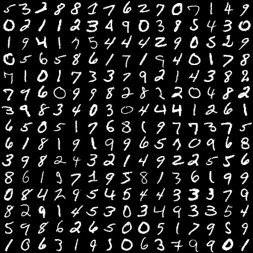
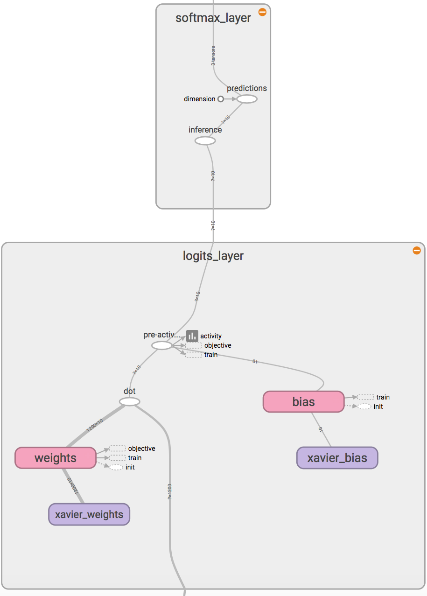

Softmax Layer
=============

The filter weights that were initialized with random numbers become task specific as we *learn*.
Learning is a process of changing the filter weights so that we can expect a particular output mapped for 
each data samples. 
Consider the task of handwritten digit recognition :cite:`lecun1990handwritten`.
Here, we attempt to map images (:math:`28 \times 28` pixels) to an integer :math:`y \in [0,1 \dots 9]`.
`MNIST <http://yann.lecun.com/exdb/mnist/>`_ is the perfect dataset for this example, which was desigend for this purpose.  
MNIST images typically look as follows: 

    MNIST dataset of handwritten character recognition.

Learning in a neural network is typically achieved using the back-prop learning strategy.
At the top end of the neural network with as many layers is a logistic regressor that feeds off of the last layer of activations, 
be it from a fully-connected layer as is conventional or a convolutional layer such as in some recent network implementations
used in image segmentation :cite:`long2015fully`.
When the layer feeding into a softmax layer is a dot-product layer with an identity activation :math:`\alpha(x) = x`, we refer to the inputs 
often as *logits*. 
In modern neural networks, the logits are not limited in operation with any activations. 
Often, this regressor is also implemented using a dot-product layer, for logistic regression is simply 
a dot-product layer with a softmax activation.

A typical softmax layer is capable of producing the probability distribution over the labels :math:`y \in [0, 1, \dots c]`
that we want to predict.
Given an input image :math:`\mathbf{x}`, :math:`P(y \vert \mathbf{x})` is estimated as follows,

.. math::
    \begin{bmatrix}
    P(y = 1 \vert \mathbf{x}) \\
    \vdots \\
    P(y = c \vert \mathbf{x} ) 
    \end{bmatrix}
    =
    \frac{1}{\sum\limits_{p=1}^c e^{w^{p}N'(\mathbf{x})}}
    \begin{bmatrix}
    e^{w^{1}N'(\mathbf{x})} \\
    \vdots \\
    e^{w^{c}N'(\mathbf{x})} 
    \end{bmatrix},

where, :math:`\mathbf{w}` is the weight matrix of the dot-product layer preceding the softmax layer 
with :math:`w^{p}` representing the weight vector that produces the output of the class :math:`p` and
:math:`N'(\mathbf{x})` is the output of the layer in the network :math:`N`, immediately preceding
this dot-product-softmax layer. 
The label that the network predicts :math:`\hat{y}`, is the maximum of these probabilities,

.. math::
    \hat{y} = \text{arg}\max\limits_y P(y \vert \mathbf{x}).

Implementation
--------------

I implemented the softmax layer as follows:

    * Use a :meth:`lenet.layers.dot_product_layer` with 10 neurons and ``identity`` activation.
    * Use a :meth:`lenet.layers.softmax_layer` to produce the softmax.

In the softmax layer, we can return computational graph nodes to predictions, logits and softmax.
The reason for using logits will become clear in the next section when we discuss errors and 
back prop. Essentially, we will create a layer that will look like the following image in its tensorboard
visualization:

    Softmax Layer implementation. 
    
    
The logits layer is a :meth:`lenet.layers.dot_product_layer` with identity activation (no activation). 
The ``inference`` node will produce the softmax and the ``prediction`` node will produce the label predicted. 
Th softmax layer is implemented as:

.. code-block:: python

    inference = tf.nn.softmax(input, name = 'inference')
    predictions = tf.argmax(inference, 1, name = 'predictions')

Where :meth:`tf.nn.softmax` and :meth:`tf.nn.argmax` have similar syntax as the theano counterparts. 
To have the entire layer, in the :class:`lenet.network.lenet5` which is where these layer methods are called, 
I use the following strategy:

.. code-block:: python

    # logits layer returns logits node and params = [weights, bias]
    logits, params = lenet.layers.dot_product_layer  (   
                                            input = fc2_out_dropout,
                                            neurons = C,
                                            activation = 'identity',
                                            name = 'logits_layer')
    # Softmax layer returns inference and predictions
    inference, predictions = lenet.layers.softmax_layer (
                                            input = logits,
                                            name = 'softmax_layer' ) 

Where ``C`` is a globally defined variable with ``C=10`` defined in ``lenet.gloabl_definitions`` file.
The layer definitions can be seen in full in the documentation of the :meth:`lenet.layers.softmax_layer` method. 